# pdf2md

pdf2md converts PDF documents into editable Markdown. It is aimed at technical
documents, reports and manuals: text, tables, figures and structure are carried
over, and each conversion is checked against the original. The conversion
itself is done by an LLM. The main output format is Quarto `.qmd`; plain `.md`
and GitHub-Flavored `.gfm` are also supported.

## Quick start

```bash
# Install (editable, so a git pull is enough to update later)
pip install -e .

# One-time setup (API key + default model)
python3 pdf2md.py --setup

# Convert a PDF
python3 pdf2md.py document.pdf

# Batch convert a directory
python3 pdf2md.py inbox/ --out output/

# Output format
python3 pdf2md.py document.pdf --format gfm    # GitHub-Flavored Markdown
python3 pdf2md.py document.pdf --format md     # Plain Markdown
python3 pdf2md.py document.pdf --render        # Also render to PDF via Quarto

# Use a YAML frontmatter template (with --format qmd or gfm)
python3 pdf2md.py document.pdf --template path/to/template.qmd
python3 pdf2md.py document.pdf --template https://raw.githubusercontent.com/org/repo/main/template.qmd
```

With `--template`, the YAML frontmatter from the template is injected into the
conversion prompt. The LLM fills in the document-specific values (title, date
and so on) but keeps the field set and order from the template, so all
converted documents end up with the same header layout.

## How it works

A PDF becomes Markdown in four phases. The text goes through the LLM, the
images go around it.



Figures are cropped out of the PDF before conversion and replaced with numbered
`[FIG_n]` boxes. The LLM only transcribes text and carries these tokens
through; afterwards the original images are put back where the tokens are.
Tables get the opposite treatment: they are never cropped, so the model can
transcribe their content. At the end of a run, a set of checks compares the
result with the source document. Missing tables, links and code blocks are
restored deterministically from the source; pages still missing prose after
that are re-sent to the LLM one page at a time, and only text not already
present in the output is inserted.

## Output files

Each converted document produces:

- `<stem>.qmd` — the converted document (or `.md`/`.gfm`, see `--format`)
- `<stem>-media/` — figures extracted from the source PDF
- `verify_report.md` — results of the fidelity checks, worth a look before trusting the output
- `postfix_report.md` — coverage before and after the automatic fixes

## Configuration

API key and default model are stored in `~/.pdf2md/`:

- `key` — OpenRouter API key (mode 600)
- `config.json` — model selection + auto-cached model limits from OpenRouter API

```bash
python3 pdf2md.py --setup    # Interactive configuration
```

## Model Selection

Not all models work equally well for PDF conversion. Before switching models, run
the bundled edge-case benchmark to see how a candidate model handles tricky content:

```bash
python3 pdf2md.py src/pdf2md/tests/fixtures/pdf2md_edgecases.pdf \
    --out /tmp/benchmark-out/ \
    --model <model-slug> \
    --postfix 0
```

Then check `verify_report.md` — the document is designed to surface failures in:

- Table detection: text-based tables with merged cells, plus rasterized PNG tables
- Figure extraction: embedded charts, wrapped figures, subfigures
- Text fidelity: soft hyphens, ligatures, Unicode, intra-word formatting changes
- Structure: nested lists, definition lists, blockquotes, task lists, two-column layout
- Scientific content: chemical formulas, subscripts/superscripts, display equations
- Metadata: YAML frontmatter generation (title detection, date parsing)

Text-only models fail the figure placement check, so stick to multimodal models.

## Known model pitfalls

The tool checks the chosen model against OpenRouter's metadata before spending
anything (file input support, context window vs. document size) and prints a
`model check` box when something won't work. Two pitfalls it can only warn about:

- **Copyright / recitation guardrails.** Some models (seen with gemini-pro
  variants) refuse to reproduce text from published documents. The failure is
  confusing: no clear error, just near-zero coverage or empty responses while
  tokens are still billed. If a strong model produces inexplicably bad coverage
  on a published PDF, suspect this first and switch models —
  `google/gemini-2.5-flash` has not shown this behaviour.
- **Reasoning models burning the budget.** Thinking models (gemini-pro, gpt-5)
  can spend thousands of completion tokens on hidden reasoning and return little
  or no text at modest `max_tokens`. The error message says so when it happens.

## Authors & license

pdf2md was extracted from [CLMS_documents](https://github.com/MatMatt/CLMS_documents).

- Maciej Dudek
- Matteo Mattiuzzi

Copyright © 2026 European Union. Licensed under [EUPL-1.2](LICENSE).
